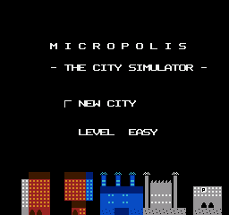
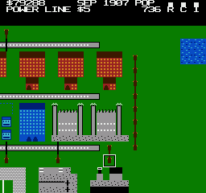
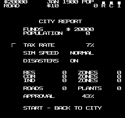
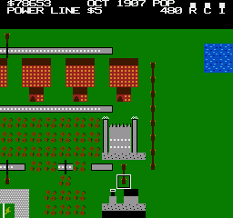

# MICROPOLIS — SimCity for the NES

A faithful NES demake of the original 1989 SimCity (whose open-source release
is named *Micropolis*), rebuilt from scratch in 6502 assembly. Zone cities,
lay roads and power lines, balance the budget, and watch your town grow —
or burn.

*Mapper: MMC1 · PRG: 32KB · CHR: 8KB · Save: battery WRAM*

| | | |
|---|---|---|
|  |  |  |

## Play It

Load `micropolis.nes` in any NES emulator (Mesen, FCEUX, Nestopia,
RetroArch/QuickNES...). The cartridge is MMC1 with battery-backed save RAM:
**your city is saved automatically** (yearly and whenever you open the city
report), and the title screen offers CONTINUE when a save exists.

## Controls

| Button | Action |
|--------|--------|
| D-pad | Move cursor (hold to repeat; pushes the view at the screen edge) |
| **A** | Use current tool at the cursor |
| **B** | Open / close the build menu |
| **Select** | Quick-cycle to the next tool |
| **Start** | City report: budget, tax rate, sim speed, disasters |

On the title screen: Up/Down picks NEW CITY / CONTINUE, Left/Right sets
difficulty (starting funds: $20,000 / $10,000 / $5,000).

## Building a City

Everything works like the original:

- **Zones** (Residential / Commercial / Industrial, $100) are 3×3 plots.
  They develop only when **powered** and **connected to a road** (within two
  cells of the zone). Unpowered zones flash a lightning bolt.
- **Power** comes from coal ($3,000) or nuclear ($5,000) plants and flows
  through power lines ($5) and through zones themselves — adjacent zones
  conduct to each other.
- **Roads** ($10) auto-connect, cross power lines and rails, and cost money
  yearly in maintenance. **Rail** ($20) is prettier and sturdier but costs
  more upkeep.
- **Crossing water**: place the power-line or rail tool directly on a river
  to build a pylon crossing or trestle bridge. Bulldozing one gives the
  water back.
- **RCI demand** (bars in the status bar) drives growth: jobs attract
  residents, residents feed commerce and industry, and high taxes scare
  everyone away.
- Zones grow through four stages: empty plot → houses/shops/factories →
  denser development → full city block. Top density requires the big
  amenities, as in the original:
  - Residential wants a **Stadium** ($5,000)
  - Industrial wants a **Seaport** ($3,000)
  - Commercial wants an **Airport** ($10,000)
- **Police & fire stations** ($500 + $100/yr) keep crime down and fires
  short. **Parks** ($10) make the map pretty.

## Money & Time

Taxes are collected every January: revenue scales with population and the
tax rate (adjust it in the city report, Start). Road/rail maintenance and
station funding are deducted at the same time. A month of city time passes
every couple of seconds at Normal speed.

## Disasters

Leave disasters ON if you dare: fires break out and spread through trees and
buildings, tornadoes carve rubble tracks across the map, and if you built a
nuclear plant... it can melt down. Fires burn out faster if you have fire
stations. The bulldozer can't stop a fire — clear firebreaks around it.



*(An actual test run: a tornado leveled the commercial district, which cut
power to the seaport — note the blackout bolt.)*

## Advisor Messages

The status bar's third line reports what the city needs: more power,
blackouts, housing shortages, job shortages, amenity requests, rising crime,
fires and tornado warnings.

## Building From Source

Requires `cc65` and Python 3:

```
cd simcity
make            # tools/gfx.py builds chr.bin, ca65/ld65 build micropolis.nes
```

### Testing

The project includes a small headless NES emulator (pure Python) used for
automated testing:

```
python3 tools/nesemu.py micropolis.nes --frames 300 --png out.png \
    --input "70:A,120-160:R"          # scripted controller input
python3 tools/play_test.py            # end-to-end sim regression test
python3 tools/test_city.py            # big-city integration test
python3 tools/preview.py cells.png    # render the tile-art contact sheet
```

## Architecture Notes

- **Mapper**: MMC1, 32KB PRG + 8KB CHR + 8KB battery WRAM. The 64×48-cell
  map lives in WRAM (3KB codes + 3KB per-cell state), which is what makes
  battery saves free.
- **Rendering**: the visible 16×13-cell viewport is drawn into one
  nametable while the other is prepared in the background; scrolling pages
  flip between them, so there are no mid-frame scroll splits or attribute
  seams. All PPU writes go through a vblank-budgeted queue drained by the
  NMI handler, with an overflow ring for deferred cell redraws.
- **Simulation**: a continuous scan sweeps the map (budgeted per frame),
  followed by a breadth-first power flood-fill seeded from plants. Power
  uses two bits per cell (computing/displayed) so the grid updates without
  flicker. Zone growth rolls against signed RCI demand computed monthly.
- **Graphics**: 16×16-pixel map cells (2×2 tiles + one palette), with all
  road/rail/wire shapes derived from neighbors at draw time and big
  buildings composed from a shared 8×8 texture library to fit 165 cell
  graphics in 241 CHR tiles.
